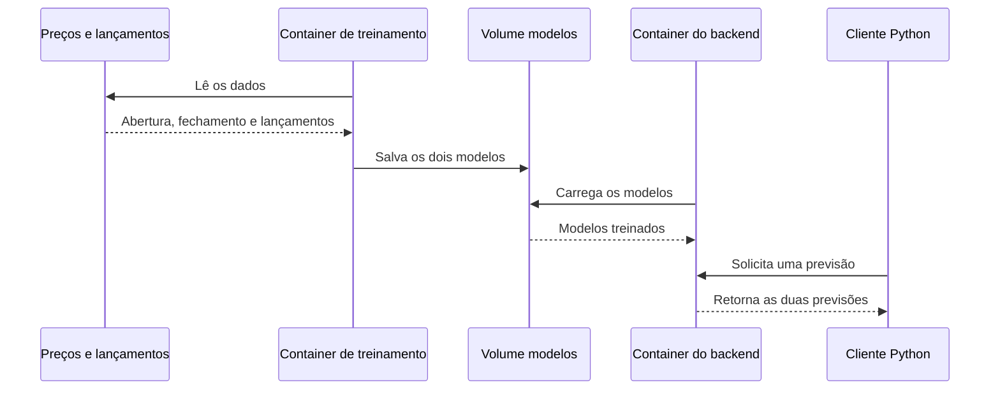
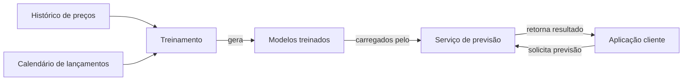
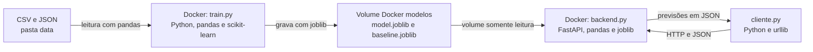
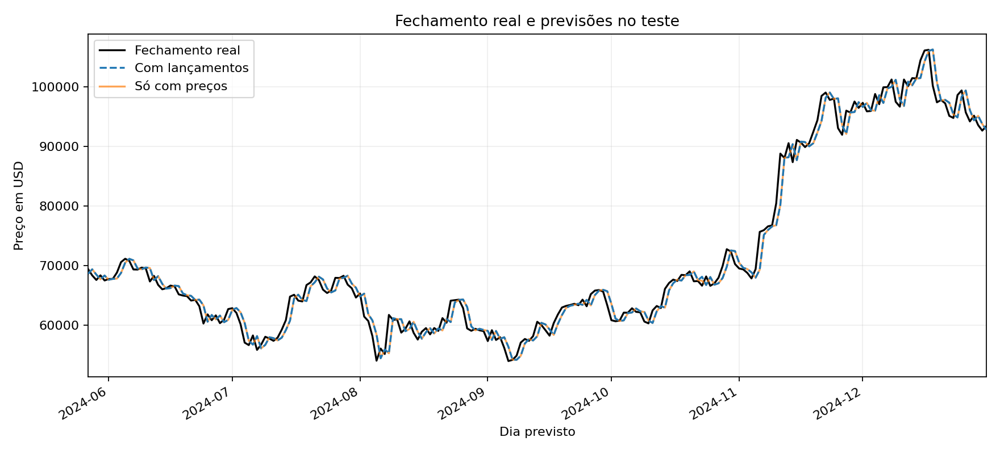
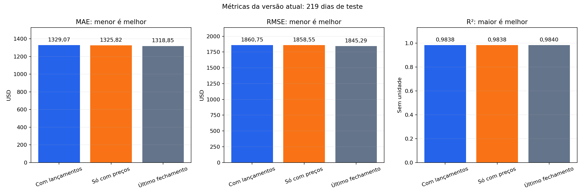
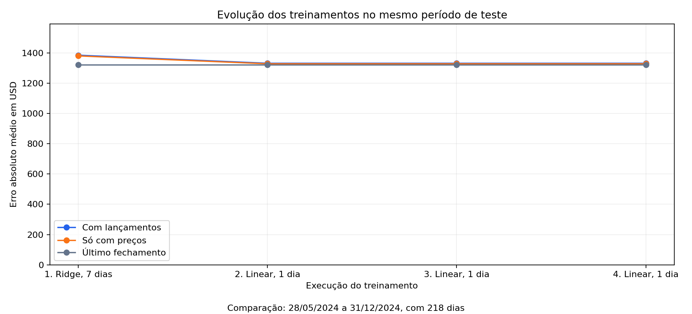

# Bitcoin e Diário de um Banana

Este projeto usa preços diários do Bitcoin e datas de lançamento dos livros de Diário de um Banana para prever o fechamento da moeda no dia seguinte. Ele foi feito como atividade de aula para praticar a arquitetura de uma aplicação que treina um modelo em um container Docker e disponibiliza as previsões por um backend Python em outro container. A comparação com e sem os lançamentos dos livros serve para explorar essa ideia, sem afirmar que eles causam mudanças no Bitcoin. **Este parágrafo de apresentação e as fórmulas em LaTeX foram feitos utilizando IA para facilitar as explicações.**

## 14h13: Definindo a solução

Quis prever o fechamento do Bitcoin no dia seguinte usando abertura, fechamento e as datas dos lançamentos de Diário de um Banana. Comecei pelo README para registrar a ideia e os diagramas.

Separei treino e backend. Minha dúvida no UML foi como passar o modelo entre os containers: salvar só dentro do treino não bastava. Usei o volume `modelos` para compartilhar os arquivos.

### UML: sequência das trocas

O UML mostra a ordem: o treino lê os dados e salva os modelos. Depois, o backend carrega os arquivos e responde ao cliente, sem treinar de novo.



O volume liga os containers: o treino grava e o backend lê.

### Arquitetura agnóstica

Este desenho mostra as responsabilidades sem depender das ferramentas: dados alimentam o treino, e o serviço usa os modelos para responder ao cliente.



As ferramentas podem mudar sem alterar esse fluxo.

### Arquitetura de tecnologias

Aqui coloquei as tecnologias: pandas organiza os dados, scikit-learn treina, joblib salva os modelos e FastAPI atende às consultas.



Usei um `Dockerfile` para os dois containers. O volume `modelos` aparece como `/app/artifacts` e continua disponível quando o treino termina. O cliente Python consulta o backend por HTTP.

## 14h35: Escolhendo os dados

Usei os preços diários de Bitcoin em dólar da Bitstamp, pela [CryptoDataDownload](https://www.cryptodatadownload.com/data/bitstamp/), de janeiro de 2022 a dezembro de 2024.

Com ajuda de IA, selecionei o recorte e conferi os dados: 1.096 dias, sem datas repetidas ou faltantes, com abertura e fechamento positivos.

Criei `prepare_data.py` para repetir essa preparação. Guardei o CSV original em `data/Bitstamp_BTCUSD_d.csv` e usei esse arquivo para fazer o recorte. O script ignora a linha extra antes do cabeçalho, filtra o período e ordena as datas. Gera `data/btc_daily.csv` com os preços e `data/source.json` com a origem. Se o original já estiver na pasta, a preparação usa essa cópia sem baixar de novo.

## 14h39: Juntando os lançamentos dos livros

Usei três lançamentos originais da série principal. [Diper Överlöde](https://wimpykid.com/books/diary-of-a-wimpy-kid-book-17/) saiu em 25/10/2022, [No Brainer](https://wimpykid.com/books/diary-of-a-wimpy-kid-book-18/) em 24/10/2023 e [Hot Mess](https://wimpykid.com/books/hot-mess/) em 22/10/2024. Conferi as datas no site oficial.

Criei `data/book_releases.json` para guardar as datas e fontes fora do código. No treino, `book_release` vale 1 no lançamento e 0 nos outros dias.

Juntei os arquivos pela data. Usar a posição das linhas daria errado, já que o calendário tem três registros e o histórico tem mais de mil.

## 14h43: Montando o modelo

Depois dos dados e do calendário, criei `train.py`. Ele junta as entradas, separa treino e teste e salva os modelos. Usei regressão linear para prever o fechamento seguinte e comparei com uma Ridge de sete dias no histórico.

Criei `next_close` com `shift(-1)`: os preços do dia 22 ficam ligados ao fechamento do dia 23. Removi a última linha, que não tem dia seguinte. Usar o fechamento do próprio dia como alvo entregaria a resposta ao modelo.

Mantive a ordem das datas: os primeiros 80% ficaram para treino e os últimos 20% para teste. Salvei os dados com lançamentos e alvo em `artifacts/dataset.csv` e as divisões em `artifacts/train.csv` e `artifacts/test.csv` para conferir cada etapa. Treinei uma versão com livros e outra só com preços, salvas em `artifacts/model.joblib` e `artifacts/baseline.joblib`. Também avaliei a opção de repetir o último fechamento.

### Por que usei scikit-learn e joblib

Usei scikit-learn porque a regressão linear já está pronta: treino com `fit` e consulto com `predict`. Com PyTorch, precisaria montar o modelo e o processo de treino, como no [tutorial oficial](https://docs.pytorch.org/tutorials/beginner/basics/intro.html). Para esta comparação, preferi a solução mais simples.

Joblib cuida de salvar e carregar, como explica a [documentação do scikit-learn](https://scikit-learn.org/stable/model_persistence.html): `joblib.dump` no treino e `joblib.load` no backend. PyTorch seria uma alternativa para treinar. Já o joblib guarda o modelo escolhido. Usei a mesma imagem Docker para manter as versões das bibliotecas iguais.

## 14h51: Executando o treinamento no Docker

Executei o treino no Docker, salvando os arquivos no volume `modelos`. Ficaram 1.095 pares de dias: 876 para treino e 219 para teste. Os alvos do treino vão de 02/01/2022 a 26/05/2024. Os do teste vão de 27/05/2024 a 31/12/2024.

### Como avaliei: MAE, RMSE e R²

Usei três métricas para comparar as mesmas previsões. Nas fórmulas, `n` é a quantidade de dias do teste (219), `i` indica cada dia, `y` é o fechamento real de `next_close` e `ŷ` é a previsão do modelo.

O **MAE** é a média das distâncias entre previsão e valor real. O módulo impede que erros para cima e para baixo se anulem. O resultado fica em dólares: quanto menor, melhor.

```math
MAE = \frac{1}{n}\sum_{i=1}^{n}|y_i - \hat{y}_i|
```

Por exemplo, em 27/05/2024 o valor real foi US$ 69.392,00 e a previsão com livros foi US$ 68.604,17. A distância foi US$ 787,83. O MAE faz essa conta para todos os dias e tira a média, sem arredondar as previsões antes.

O **RMSE** também fica em dólares, mas o quadrado dá mais peso aos erros grandes. A raiz devolve a conta para a unidade do preço. Quanto menor, melhor.

```math
RMSE = \sqrt{\frac{1}{n}\sum_{i=1}^{n}(y_i - \hat{y}_i)^2}
```

O **R²** compara os erros do modelo com os erros de usar a média dos fechamentos reais do teste. Na fórmula, `ȳ` é essa média, calculada a partir de `next_close`. Ela entra só na avaliação.

```math
R^2 = 1 - \frac{\sum_{i=1}^{n}(y_i - \hat{y}_i)^2}{\sum_{i=1}^{n}(y_i - \bar{y})^2}
```

A parte de cima soma os erros quadráticos do modelo. A de baixo faz o mesmo para a média. R² igual a 1 significa previsão perfeita, 0 equivale a usar a média e um valor negativo indica resultado pior. Quanto maior, melhor. Ele não é uma porcentagem de acerto.

Em `train.py`, usei `mean_absolute_error`, `root_mean_squared_error` e `r2_score`. O `metrics.json` guarda as três métricas para o modelo com livros, o modelo só com preços e a referência de repetir `close` como previsão do dia seguinte.

### Resultados da avaliação

Comparei as três opções nos mesmos dias. Com livros, o MAE foi US$ 1.329,07, o RMSE foi US$ 1.860,75 e o R² foi 0,9838. Só com preços, ficaram em US$ 1.325,82, US$ 1.858,55 e 0,9838. Repetindo o último fechamento, os resultados foram US$ 1.318,85, US$ 1.845,29 e 0,9840. O gráfico de métricas abaixo mostra essa comparação.

Repetir o fechamento foi melhor nas três métricas. O RMSE ficou acima do MAE, mostrando o peso dos erros maiores. Apesar do R² perto de 1, os erros ainda passam de mil dólares e os modelos não superam essa referência simples. Os lançamentos não melhoraram o teste, que tem só dois eventos no treino e um no teste.

Carreguei os modelos e conferi as 219 previsões, o alvo no dia seguinte e a separação das datas. Salvei [metrics.json](artifacts/metrics.json), [test_predictions.csv](artifacts/test_predictions.csv) e o [exemplo de entrada](artifacts/sample_request.json), com os preços de 22/10/2024 e o lançamento de Hot Mess.

### Como executar o treinamento

Com o Docker instalado e aberto, execute na pasta do projeto:

```sh
docker build -t bitcoin .
docker run --rm -v modelos:/app/artifacts bitcoin
```

O primeiro comando cria a imagem. O segundo treina e salva em `modelos`. O Docker cria o volume no primeiro uso. Os dados já estão no repositório, então não preciso baixá-los de novo.

Para executar com Python 3.13:

```sh
python3 -m venv .venv
source .venv/bin/activate
pip install -r requirements.txt
python train.py
```

Para refazer o recorte usando o CSV original preservado, depois de instalar as bibliotecas:

```sh
python prepare_data.py
python train.py
```

## 15h12: Colocando o modelo em um serviço

Criei `backend.py` depois dos modelos para testar o deploy local com FastAPI. Ele carrega os arquivos ao iniciar e oferece `GET /health` e `POST /predict`. FastAPI e Uvicorn estão no `requirements.txt`. O mesmo `Dockerfile` executa o serviço com `python backend.py`.

Mantive as colunas na ordem do treino: `open`, `close`, `book_release`. O modelo só de preços recebe as duas primeiras. A API exige preços positivos e lançamento igual a 0 ou 1.

Testei no segundo container, com volume somente leitura, e a previsão bateu com o modelo salvo. Sem os modelos, o serviço não iniciou.

A rota `/health` respondeu:

```json
{"status": "ok"}
```

Com o exemplo de 22/10/2024, `/predict` respondeu:

```json
{
  "with_releases": 68105.98,
  "prices_only": 67421.02,
  "difference_usd": 684.96,
  "horizon_days": 1
}
```

Campos ausentes, abertura zero, fechamento negativo, lançamento igual a 2 e preço em texto retornaram HTTP 422. Saúde, previsão e página de testes retornaram 200.

Registrei a [previsão](artifacts/backend_response.json), a [saúde](artifacts/health.json) e as [verificações HTTP](artifacts/backend_checks.json).

### Como executar o backend

Depois de executar o treinamento, reconstrua a imagem para incluir o backend e inicie o segundo container:

```sh
docker build -t bitcoin .
docker run -d --name bitcoin-api -p 8000:8000 -v modelos:/app/artifacts:ro bitcoin python backend.py
```

O `-d` mantém o serviço rodando, `8000:8000` libera a porta e `ro` deixa o volume somente para leitura.

Para conferir se está ativo:

```sh
curl http://localhost:8000/health
```

Para pedir uma previsão com o exemplo salvo no projeto:

```sh
curl -X POST http://localhost:8000/predict -H "Content-Type: application/json" -d @artifacts/sample_request.json
```

Também dá para abrir `http://localhost:8000/docs` e testar a API pelo navegador. O JSON de entrada tem este formato:

```json
{
  "open": 67345,
  "close": 67382,
  "book_release": 1
}
```

A resposta traz as previsões em USD, a diferença entre os modelos e o horizonte de um dia. Essa diferença não demonstra que o livro causou uma mudança no preço.

Para parar e remover apenas o container do serviço:

```sh
docker stop bitcoin-api
docker rm bitcoin-api
```

Para executar sem Docker, com as bibliotecas instaladas e os arquivos do modelo na pasta `artifacts`, use `python backend.py`.

Para retomar um container parado, use `docker start bitcoin-api`. Para atualizar o código, remova o container, reconstrua a imagem e execute de novo. O volume é mantido.

## 15h34: Transformando os resultados em gráficos

Depois de testar o backend, criei `graficos.py` com matplotlib para transformar os resultados em imagens. Cada treino registra uma linha em `artifacts/training_history.csv`. O primeiro também ficou em `artifacts/first_training.json`.

Para comparar as versões, precisei usar o mesmo período: a primeira tinha 218 dias de teste e a atual, 219. A evolução usa MAE nos 218 dias em comum, de 28/05/2024 a 31/12/2024. As três métricas atuais usam os 219 dias. As versões antigas guardaram só MAE. Repeti o treino no Docker e os erros ficaram iguais, pois não mudei dados nem modelo.

### Preços reais e previstos



As previsões acompanham os preços, mas erram nas mudanças diárias. Como as duas ficam quase sobrepostas, usei uma linha tracejada para diferenciá-las.

### Erro da versão atual



Atualizei `graficos.py` para mostrar MAE, RMSE e R² em painéis separados nos 219 dias. Cada painel usa sua própria escala. Repetir o fechamento teve os menores MAE e RMSE e o maior R².

### Evolução dos treinamentos



Comparei o MAE nos 218 dias em comum. Na primeira execução, com Ridge de sete dias, o erro foi US$ 1.384,86 com livros e US$ 1.380,20 só com preços. Na segunda, com regressão linear de um dia, caiu para US$ 1.331,56 e US$ 1.328,28. Repetir o fechamento ficou em US$ 1.320,76 nas quatro execuções.

A linear teve MAE menor que a Ridge, mas ambas perderam para repetir o fechamento. O terceiro e o quarto treinos mantiveram dados e modelo, então o MAE ficou igual. No quarto, também registrei RMSE e R² na avaliação atual. O gráfico lê [training_history.csv](artifacts/training_history.csv). Ao mudar o modelo, preciso atualizar o nome da versão em `train.py`.

### Como gerar os gráficos

Com as bibliotecas instaladas no ambiente Python, posso reproduzir as imagens a partir dos resultados que já estão no repositório:

```sh
python graficos.py
```

Para um novo treinamento no Docker e novos gráficos, depois de reconstruir a imagem:

```sh
docker run --rm -v modelos:/app/artifacts bitcoin
docker run --rm -v modelos:/app/artifacts bitcoin python graficos.py
```

O histórico acumula as execuções do volume. Em um volume novo, começa do zero. As avaliações anteriores estão no repositório.

Depois de iniciar o backend, posso trazer os arquivos do volume para o projeto e atualizar as imagens do README:

```sh
docker cp bitcoin-api:/app/artifacts/. artifacts/
```

O comando copia os arquivos para `artifacts`, incluindo as imagens em `artifacts/graficos`. Se os modelos forem treinados de novo, reinicio o backend com `docker restart bitcoin-api` para carregar os arquivos atualizados.

## 15h41: Testando o cliente

Criei `cliente.py` com `urllib`, que já vem no Python. Ele confere `/health`, lê `artifacts/sample_request.json` e faz duas consultas com os mesmos preços: uma com lançamento e outra sem. Salva as respostas em [client_response.json](artifacts/client_response.json).

Com o backend rodando, execute na pasta do projeto:

```sh
python3 cliente.py
```

A saúde respondeu `ok`. Com lançamento, o modelo com livros previu US$ 68.105,98. Sem lançamento, previu US$ 67.421,40. O modelo só com preços retornou US$ 67.421,02 nos dois pedidos.

Só mudei a marcação. A previsão do modelo com livros variou US$ 684,58. A do modelo só com preços ficou igual. Isso mostra como o modelo responde à entrada, sem provar que os livros influenciam o Bitcoin. São só três lançamentos no período, e as previsões são experimentais, não uma recomendação de investimento.

Também conferi o fluxo com um volume vazio: treinei, iniciei outro container e consultei a API. As previsões bateram com os arquivos salvos e as entradas inválidas retornaram 422. Registrei essa conferência em [review_checks.json](artifacts/review_checks.json).

## Estrutura do projeto

```text
.
├── README.md
├── Dockerfile
├── requirements.txt
├── .gitignore
├── .dockerignore
├── prepare_data.py
├── train.py
├── backend.py
├── cliente.py
├── graficos.py
├── data/
│   ├── Bitstamp_BTCUSD_d.csv
│   ├── btc_daily.csv
│   ├── book_releases.json
│   └── source.json
└── artifacts/
    ├── dataset.csv
    ├── train.csv
    ├── test.csv
    ├── model.joblib
    ├── baseline.joblib
    ├── metrics.json
    ├── test_predictions.csv
    ├── sample_request.json
    ├── first_training.json
    ├── training_history.csv
    ├── health.json
    ├── backend_response.json
    ├── backend_checks.json
    ├── client_response.json
    ├── review_checks.json
    └── graficos/
        ├── previsoes.png
        ├── erros.png
        └── evolucao.png
```

Deixei os scripts na raiz para facilitar a execução. A pasta `data` guarda o CSV original, o recorte dos preços, o calendário dos livros e a fonte. Em `artifacts`, ficam os dados prontos para o modelo, as divisões de treino e teste, os modelos exportados, as previsões, as métricas e as respostas dos testes. Em `artifacts/graficos`, ficam as imagens usadas neste README. O `Dockerfile` monta a imagem com as bibliotecas de `requirements.txt`.
